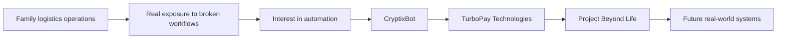

<!--
THE MEDHIR INDEX
A personal GitHub profile by Medhir Lokhande
-->

<div align="center">

# THE MEDHIR INDEX

### Founder · Operator · Researcher

*A living record of what I have built, what shaped me, and what I am still trying to understand.*

<br>

<a href="https://turbo-pay.in"><strong>TURBOPAY ↗</strong></a>
&nbsp;&nbsp;&nbsp;·&nbsp;&nbsp;&nbsp;
<a href="https://cryptixbot.com"><strong>CRYPTIXBOT ↗</strong></a>
&nbsp;&nbsp;&nbsp;·&nbsp;&nbsp;&nbsp;
<a href="https://www.linkedin.com/in/medhirr"><strong>LINKEDIN ↗</strong></a>
&nbsp;&nbsp;&nbsp;·&nbsp;&nbsp;&nbsp;
<a href="mailto:medhir@turbo-pay.in"><strong>EMAIL ↗</strong></a>

<br><br>

<sub>MUMBAI, INDIA · FINTECH × AI × SYSTEMS · CURRENTLY BUILDING</sub>

</div>

---

```text
INDEX CARD / 001

NAME        Medhir Lokhande
ROLE        Founder & CEO
COMPANY     TurboPay Technologies Pvt. Ltd.
PRODUCTS    TurboPay / CryptixBot
RESEARCH    Project Beyond Life
BACKGROUND  Logistics operations / Finance / Product building
STATUS      Early, ambitious, unfinished
```

## 00 / PROLOGUE

I did not begin in a polished startup ecosystem.

I began inside a family logistics business, close to the actual work: operations, follow-ups, fragmented information, repetitive processes, customer pressure and the everyday reality of making a business function.

That experience gave me something more useful than a perfect founder story:

> **A direct view of how badly designed systems create real-world friction.**

I became interested in software because I wanted to remove that friction.

That path moved from logistics operations to automation, from automation to product building, from product building to financial technology, and from there into a much larger question:

> **What can be built when business experience, financial thinking, public knowledge and multiple AI systems are brought into one disciplined process?**

This profile is an index of that journey.

---

## 01 / THE PATH



### The operator

I learned by being close to operating problems rather than observing them from a distance.

### The builder

I started turning problems into workflows, dashboards, software products and technical systems.

### The founder

I incorporated **TurboPay Technologies Pvt. Ltd.** to build a wider product company rather than a single isolated application.

### The researcher

I created **Project Beyond Life**, a private long-term initiative for structured multidisciplinary research using multiple AI systems and publicly available knowledge.

---

## 02 / THE WORLD I AM BUILDING

<table>
<tr>
<td width="33%" valign="top">

### 01 — TurboPay Technologies

**The company layer**

A DPIIT-recognised technology startup focused on AI-powered financial software, merchant technology, automation and modern financial infrastructure.

The ambition is larger than one app: build a company capable of creating multiple practical software products over time.

**State:** Company-building  
**Role:** Founder & CEO

<a href="https://turbo-pay.in"><strong>Open company site →</strong></a>

</td>
<td width="33%" valign="top">

### 02 — CryptixBot

**The execution layer**

A non-custodial crypto trading automation platform combining grid strategies, AI-assisted analysis, simulation, live execution, monitoring and risk controls.

CryptixBot is where many of my ideas about governance, reliability, financial risk and real-world system behaviour are being tested.

**State:** Production hardening  
**Role:** Founder & Product Architect

<a href="https://cryptixbot.com"><strong>Open product site →</strong></a>

</td>
<td width="33%" valign="top">

### 03 — Project Beyond Life

**The research layer**

A private multidisciplinary research initiative using multiple AI systems and public knowledge to structure difficult questions, test contradictions and develop foundations for future practical solutions.

It is not a finished product, public claim or shortcut to certainty.

It is long-term research infrastructure.

**State:** Private research  
**Role:** Founder & Research Lead

</td>
</tr>
</table>

---

## 03 / WHY THESE PROJECTS BELONG TOGETHER

At first glance, logistics, fintech, trading systems and long-term research may look unrelated.

To me, they are different expressions of the same instinct:

```text
OBSERVE REALITY
      ↓
FIND THE BROKEN SYSTEM
      ↓
UNDERSTAND THE INCENTIVES
      ↓
DESIGN A BETTER STRUCTURE
      ↓
TEST IT AGAINST THE REAL WORLD
      ↓
KEEP WHAT SURVIVES
```

TurboPay explores how financial products can become more useful and responsible.

CryptixBot explores how automated financial systems can operate with clearer controls, transparency and user ownership.

Project Beyond Life explores how large bodies of public knowledge and multiple AI systems can be organised into serious long-term research.

The common thread is not an industry.

The common thread is **systems**.

---

## 04 / PROJECT BEYOND LIFE

<div align="center">

### PRIVATE RESEARCH INITIATIVE

*Long-horizon questions. Public knowledge. Multiple AI systems. Structured synthesis.*

</div>

Project Beyond Life exists because some questions are too large for casual brainstorming and too important for one-model answers.

The project studies broad themes across science, technology, philosophy, intelligence, human progress and future systems. Its purpose is to create a disciplined research foundation from which practical ideas may eventually emerge.

### Research method

<table>
<tr>
<td width="25%" valign="top">

#### 01 / COLLECT

Public papers, books, datasets, historical cases, technical material and competing viewpoints.

</td>
<td width="25%" valign="top">

#### 02 / COMPARE

Multiple AI systems analyse the same question independently rather than producing one unquestioned answer.

</td>
<td width="25%" valign="top">

#### 03 / CHALLENGE

Contradictions, assumptions, unsupported claims and governance risks are explicitly tested.

</td>
<td width="25%" valign="top">

#### 04 / SYNTHESISE

Useful findings are organised into durable research structures that may support future real-world work.

</td>
</tr>
</table>

<details>
<summary><strong>Open the research protocol</strong></summary>

<br>

```text
PROJECT BEYOND LIFE / RESEARCH PROTOCOL

01. Do not mistake confidence for evidence.
02. Separate facts, hypotheses, interpretations and speculation.
03. Use multiple independent analytical perspectives.
04. Preserve disagreements instead of forcing false consensus.
05. Track assumptions and unresolved questions.
06. Treat governance as part of the research architecture.
07. Do not claim a solution before the evidence supports one.
08. Translate research into real-world work only when the path is defensible.
```

</details>

---

## 05 / QUESTIONS I KEEP RETURNING TO

```text
How can financial products become useful without becoming predatory?

How can automation increase capability without reducing accountability?

How do you build systems that remain reliable when real money is involved?

How can multiple AI models be used without allowing confident errors to become truth?

How do we turn public knowledge into structured research rather than endless information?

Which problems are worth working on for ten years, not ten weeks?

What should a founder build now if the goal is to matter later?
```

---

## 06 / MY OPERATING PRINCIPLES

<table>
<tr>
<td width="50%" valign="top">

### Reality before narrative

A strong story cannot rescue a system that fails in actual use.

### Architecture before scale

Scaling weak foundations only multiplies the damage.

### Trust before hype

Security, compliance and transparency are not decorative features.

### Responsibility before speed

Fast execution matters. Reckless execution is not speed.

</td>
<td width="50%" valign="top">

### Questions before certainty

The quality of the question often determines the quality of the product.

### Evidence before confidence

A confident answer is still wrong when the evidence is weak.

### Systems before motivation

Good systems continue working after enthusiasm disappears.

### Long-term direction, daily execution

The mission can be large. Today's work must still be concrete.

</td>
</tr>
</table>

---

## 07 / WHAT I ACTUALLY DO

```text
FOUNDER WORK
├── Product strategy
├── Company direction
├── Business-model design
├── Go-to-market planning
├── Partnerships
└── Founder decision systems

PRODUCT WORK
├── Product architecture
├── User journeys
├── Feature prioritisation
├── Risk and control design
├── Dashboard systems
└── Prototype validation

TECHNICAL WORK
├── Python / FastAPI
├── Supabase / PostgreSQL / SQLite
├── Linux deployment
├── APIs and integrations
├── Automation workflows
└── AI-assisted development and testing

RESEARCH WORK
├── Multi-model analysis
├── Source comparison
├── Contradiction testing
├── Research governance
├── Long-form synthesis
└── Future solution mapping
```

---

## 08 / CURRENT CHAPTER

I am currently:

- Building TurboPay Technologies into a credible multi-product company.
- Preparing CryptixBot for controlled real-money onboarding.
- Developing TurboPay's consumer-finance and merchant-technology direction.
- Studying finance through my MBA while applying it in product decisions.
- Expanding Project Beyond Life as a disciplined private research system.
- Learning how to build stronger companies, not merely better-looking prototypes.

```text
CURRENT STATE

Company building        ███████████████████░
Product development     ████████████████████
Research                ██████████████████░░
Distribution            ███████████░░░░░░░░░
Experience              Compounding
Certainty                Intentionally incomplete
```

---

## 09 / OUTSIDE THE COMPANY

I am not interested only in companies.

I am interested in science, philosophy, technology, finance, storytelling and the long-term direction of human progress.

I also train regularly. Strength training has become a useful reminder that visible results come after repetitive, unglamorous work.

I like ideas that are ambitious enough to sound unreasonable at first—but only when they are followed by disciplined execution.

---

## 10 / A NOTE ON AMBITION

I am early.

Many things I am building are still incomplete. Some will change. Some may fail. Some may become much larger than they currently appear.

I would rather document that truth than manufacture the image of a finished founder.

The goal is not to look futuristic.

The goal is to build things that make the future meaningfully better.

---

## 11 / CONNECTIONS

<table>
<tr>
<td width="50%" valign="top">

### Work

**TurboPay Technologies**  
<a href="https://turbo-pay.in">turbo-pay.in ↗</a>

**CryptixBot**  
<a href="https://cryptixbot.com">cryptixbot.com ↗</a>

</td>
<td width="50%" valign="top">

### Reach me

**LinkedIn**  
<a href="https://www.linkedin.com/in/medhirr">linkedin.com/in/medhirr ↗</a>

**Email**  
<a href="mailto:medhir@turbo-pay.in">medhir@turbo-pay.in ↗</a>

</td>
</tr>
</table>

---

<div align="center">

```text
MEDHIR LOKHANDE

Founder when building.
Operator when reality breaks.
Researcher when the answer is not obvious.

Mumbai, India
```

<sub>Last principle: build something real enough that the profile eventually becomes the least interesting part.</sub>

</div>
