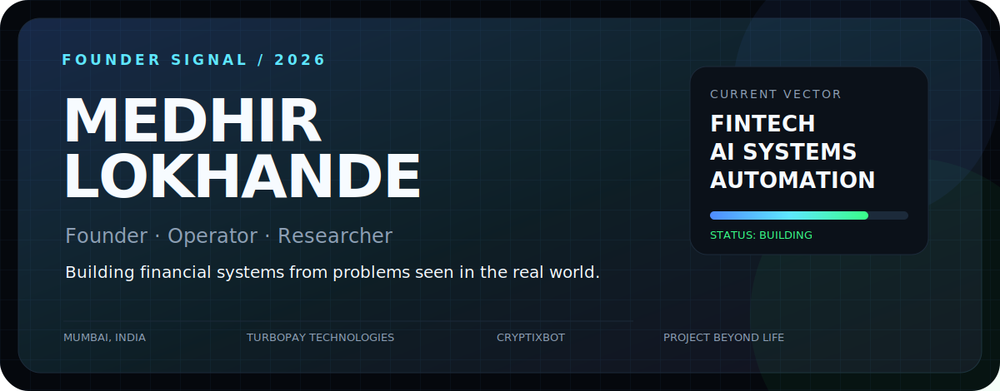
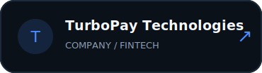
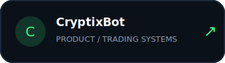
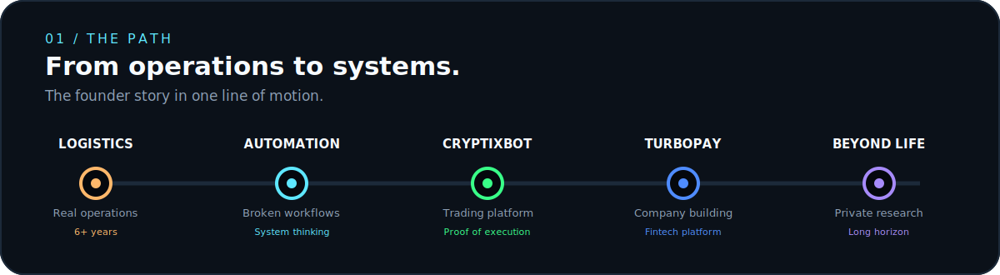
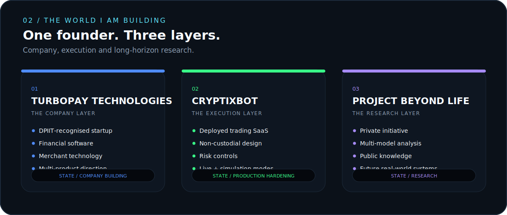
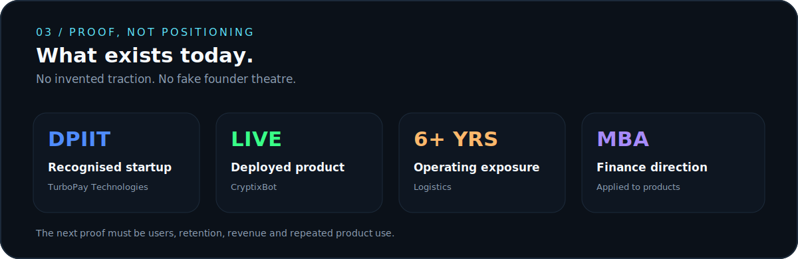
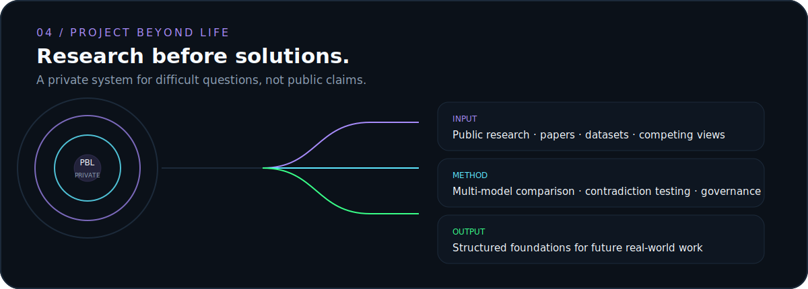
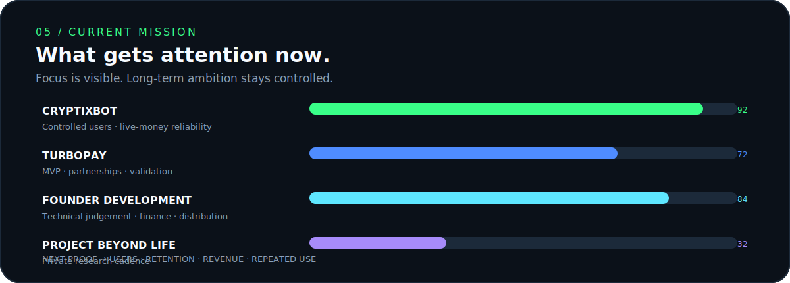

<!--
MEDHIR LOKHANDE — VISUAL FOUNDER PROFILE
All artwork in /assets is original SVG built for this repository.
-->

 

  

  

  

  

  

  

<a href="mailto:medhir@turbo-pay.in"><strong>EMAIL</strong></a>
&nbsp;&nbsp;·&nbsp;&nbsp;
<a href="https://turbo-pay.in"><strong>TURBOPAY</strong></a>
&nbsp;&nbsp;·&nbsp;&nbsp;
<a href="https://cryptixbot.com"><strong>CRYPTIXBOT</strong></a>
&nbsp;&nbsp;·&nbsp;&nbsp;
<a href="https://www.linkedin.com/in/medhirr"><strong>LINKEDIN</strong></a>

  

