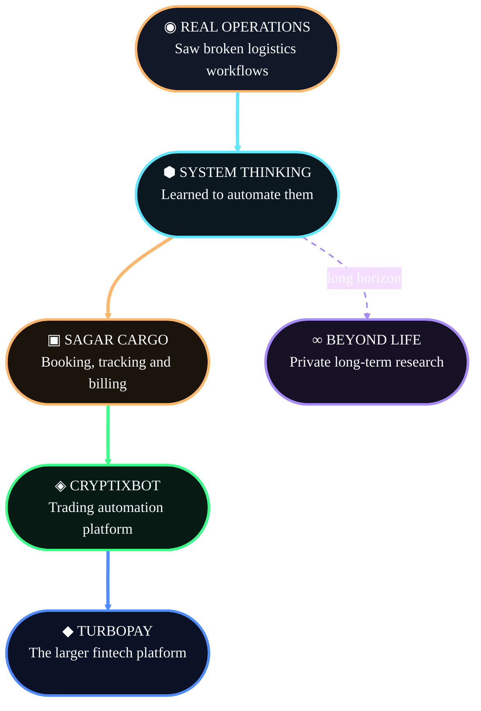
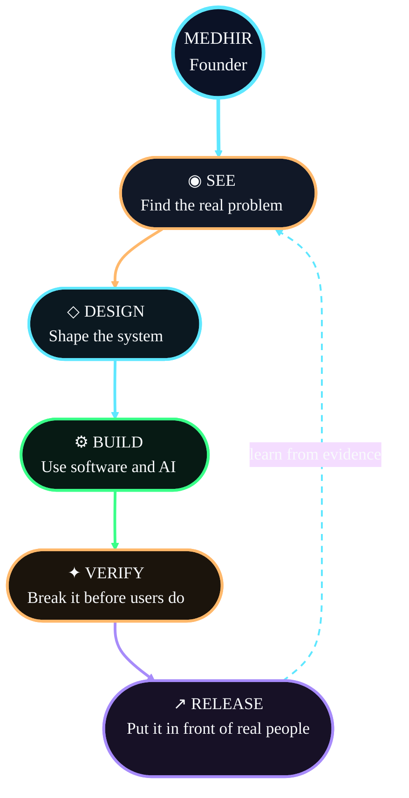

<!-- =========================================================
                     MEDHIR // FOUNDER SIGNAL
     One-file GitHub profile. No local images or extra assets.
========================================================== -->

<div align="center">


<br>

<a href="https://sagarcargo.in">
  
</a>
&nbsp;
<a href="https://turbo-pay.in">
  
</a>
&nbsp;
<a href="https://cryptixbot.com">
  
</a>
&nbsp;
<a href="https://www.linkedin.com/in/medhirr">
  
</a>
&nbsp;
<a href="mailto:medhir@turbo-pay.in">
  
</a>

<br><br>

<code>MUMBAI, INDIA</code>
&nbsp;·&nbsp;
<code>FINTECH</code>
&nbsp;·&nbsp;
<code>AI SYSTEMS</code>
&nbsp;·&nbsp;
<code>AUTOMATION</code>

</div>

---

<div align="center">

## `THE 30-SECOND STORY`

I spent **6+ years around real logistics operations** and saw how broken workflows waste time, money and human effort.

### Now I build systems that remove that friction.

</div>



---

<div align="center">

## `FOUR SYSTEMS // ONE DIRECTION`

</div>

<table>
<tr>
<td width="50%" valign="top">

<div align="center">

### `01 // DEPLOYED & WORKING`

## ▣ SAGAR CARGO SYSTEM

**Automation built for a real logistics business.**

</div>

A deployed booking, tracking and billing system built for my father's logistics business.

It replaced repetitive manual work with one connected operational workflow that is already being used to solve real problems.

```text
WORKING SYSTEM
✓ Automated bookings
✓ Shipment tracking
✓ Billing workflows
✓ Operational records
✓ Reduced manual labour
✓ Deployed in a real business
```

**What it proves:**  
I can understand an operating problem, build the system and deploy it where the work actually happens.

<div align="center">

<a href="https://sagarcargo.in">
  
</a>

</div>

</td>
<td width="50%" valign="top">

<div align="center">

### `02 // NOW`

## ◈ CRYPTIXBOT

**Trading automation without taking custody of user funds.**

</div>

Users connect their own exchange accounts and operate controlled trading systems.

```text
BUILT
✓ Grid trading
✓ Live + simulation
✓ Risk controls
✓ Monitoring
✓ User + admin systems
```

**Current mission:**  
Prove reliability with controlled real-money users.

<div align="center">

<a href="https://cryptixbot.com">
  
</a>

</div>

</td>
</tr>
</table>

<br>

<table>
<tr>
<td width="50%" valign="top">

<div align="center">

### `03 // NEXT`

## ◆ TURBOPAY

**Consumer finance connected to real merchant utility.**

</div>

A platform for responsible spending, rewards, repayment behaviour and regulated access to small credit limits.

```text
BUILDING
→ Consumer experience
→ Merchant technology
→ Rewards
→ Repayments
→ Regulated partnerships
```

**Current mission:**  
Validate demand, merchants and lending partners.

<div align="center">

<a href="https://turbo-pay.in">
  
</a>

</div>

</td>
<td width="50%" valign="top">

<div align="center">

### `04 // LONG HORIZON`

## ∞ BEYOND LIFE

**Private research for difficult future problems.**

</div>

Multiple AI systems analyse public knowledge, challenge assumptions and preserve contradictions.

```text
METHOD
◌ Collect evidence
◌ Compare models
◌ Attack weak claims
◌ Structure findings
◌ Build only when ready
```

**Current mission:**  
Research first. Real-world solutions later.

<div align="center">


</div>

</td>
</tr>
</table>

---

<div align="center">

## `WHY THESE BELONG TOGETHER`

</div>



<div align="center">

### `SEE → DESIGN → BUILD → BREAK → RELEASE → LEARN`

I use AI aggressively for development, research and testing.

**AI accelerates the work. I remain responsible for the decisions.**

</div>

---

<div align="center">

## `CURRENT SIGNALS`

<br>


&nbsp;

&nbsp;

&nbsp;

&nbsp;


<br><br>

```text
WORKING PROOF       Sagar Cargo automation in daily operations
PRIMARY MISSION     CryptixBot users + reliability
NEXT MISSION        TurboPay validation + partnerships
LONG MISSION        Research → defensible future solutions
HONEST STATUS       Early. Building. Learning fast.
```

</div>

---

<div align="center">

# I AM NOT BUILDING A PERFECT PROFILE.

# I AM BUILDING PROOF.

<br>

<a href="https://sagarcargo.in">
  
</a>
&nbsp;
<a href="https://cryptixbot.com">
  
</a>
&nbsp;
<a href="https://turbo-pay.in">
  
</a>

<br><br>

**Medhir Lokhande**  
Founder & CEO — TurboPay Technologies Pvt. Ltd.

<a href="https://www.linkedin.com/in/medhirr">LinkedIn</a>
&nbsp;·&nbsp;
<a href="mailto:medhir@turbo-pay.in">medhir@turbo-pay.in</a>
&nbsp;·&nbsp;
Mumbai, India


</div>
